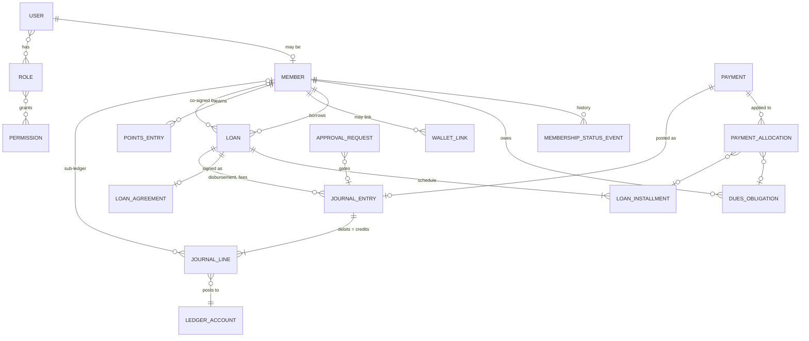
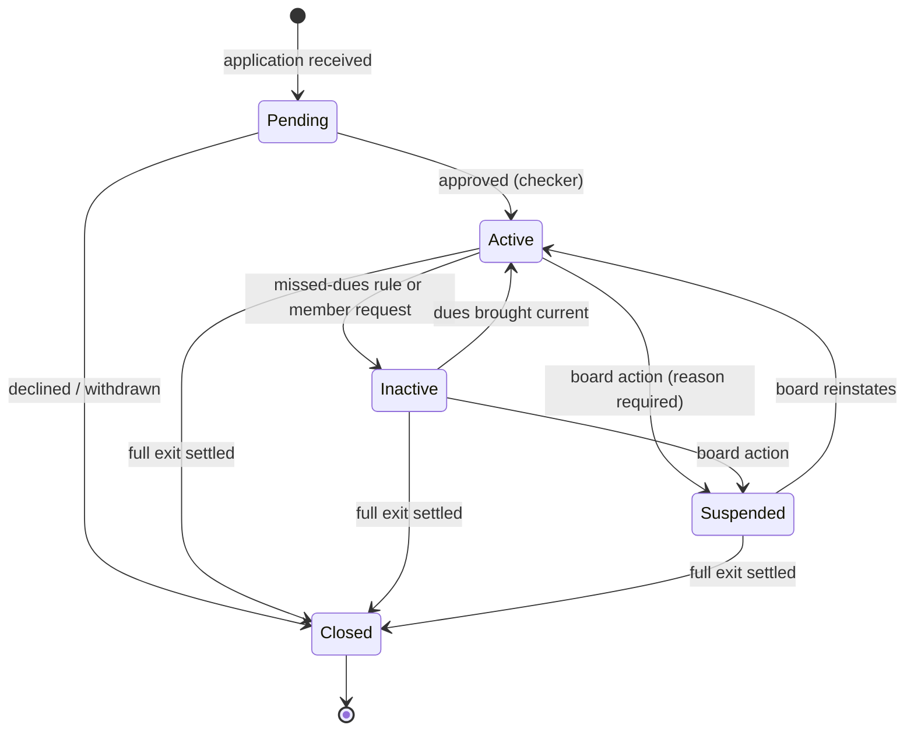

# 3–4. Domain Model and Member Management

## 1. Domain model

### Bounded contexts

Each context becomes a module inside the existing app (see [repository architecture](10-data-api-repository.md#3-repository-architecture)). A context owns its tables. Other contexts reach it through the module's functions, never through its tables directly.

| Context | Owns | Authoritative for | Layer |
|---|---|---|---|
| **Identity & Access** | users, credentials, MFA factors, sessions, roles, permissions | who someone is and what they may do | Membership |
| **Membership** | members, membership status history, levels, profile, documents | who is a member and in what standing | Membership |
| **Contributions** | contribution plans, dues obligations, contribution receipts | what each member owes and has paid in dues | Financial |
| **Lending** | applications, loans, schedules, agreements, delinquency | the state of every loan | Financial |
| **Payments** | inbound and outbound payments, provider references (Stripe, Zelle, bank, cash), allocations | money received or sent, before and after it is applied | Financial |
| **Ledger** | chart of accounts, journal entries, journal lines, periods | every financial balance; the books | Financial |
| **Approvals & Audit** | approval requests, audit log | who proposed, who approved, what changed | Cross-cutting |
| **Notifications & Documents** | email log, templates, stored files | communications and records | Cross-cutting |
| **Reporting** | read models only | nothing: every report is derived from the ledger and domain tables | Cross-cutting |
| **Rewards** | reward rules, reward events, points ledger | MC Points earned and spent | Web3 (off-chain first) |
| **Web3** | wallets, wallet links, token transfer mirror, contract registry | MCTN on-chain state (mirrored; the chain is authoritative) | Web3 |
| **Treasury** | treasury accounts, multisig proposals mirror | fiat reserve policy; MCTN treasury movements | Financial + Web3 |
| **UMI** | none until approved | — (research only) | — |

### Core relationships

### Key domain rules

1. A **User** is a login; a **Member** is a person in the club. Staff may be members, and members may have no staff role. Since M8 every login is a `User`: a staff user (email, two-factor) or a member user (member ID, portal password), each pointing at its member. An officer who is also a member has one of each (D-17).
2. A **payment** is money that arrived. An **obligation** or **installment** is money that was owed. An **allocation** links the two. This separation is what makes prepayments, partial payments and overpayments representable (F-10).
3. **Balances are never stored as the source of truth.** A member's capital, a loan's outstanding principal and the club's cash are all sums over journal lines. Cached copies are allowed only if they can be rebuilt from the ledger and are checked nightly.
4. **Fiat and MCTN never share an account, a table or a balance** (Master Prompt §9). A contribution of $20 and any points or MCTN awarded for it are separate events in separate contexts.

## 2. Member-management architecture

### Member record

| Field group | Fields | Classification |
|---|---|---|
| Identity | `id` (internal UUID), `membershipNumber` (`MC-10001`, sequential, human-facing), legal name, preferred name | Confidential |
| Contact | email, phone, mailing address | Confidential |
| Standing | status, status reason, join date, membership level (optional), good-standing flag (derived) | Internal |
| Financial pointers | none stored; contribution standing and loan eligibility are derived | — |
| Verification | verification status, method, verified at, verified by | Confidential |
| Beneficiary | beneficiary name and relationship | Confidential |
| Wallet | linked wallet addresses (Web3 context; the link itself is Confidential, see [privacy](05-security-and-privacy.md#2-privacy-architecture)) | Confidential |
| Documents | ID documents, signed agreements, membership forms (stored encrypted, not in the database) | Restricted |
| Notes | admin notes, each authored and time-stamped | Internal |

Changes to the internal `id` and `membershipNumber`:

- The internal primary key becomes an opaque UUID. It never appears in URLs shown to members.
- `membershipNumber` keeps the existing `MC-10001` format and continues the sequence. Randomly generated numbers (E-5) stop.
- Portal login uses the membership number or email, plus password or passkey.

### Status lifecycle

Rules:

- Every transition writes a `membership_status_event` row with actor, reason and timestamp. The status column is a cache of the latest event.
- **Closed** requires a settled exit. The member's capital account is zero, having been paid out or retained under the rules. No loan or co-signer obligation may remain open. Today a Full Exit only sets `Inactive` (F-13).
- **Suspended** blocks new loans, rewards and portal payments, but not repayments.
- Inactive and closed members are never deleted. Their financial history must remain reconstructible.

### Eligibility is derived, not stored

`eligible`, `thisMonth`, `currentLoanBalance`, `activeAsBorrower` and `activeAsCosigner` are computed on read from the ledger, the obligations and the loans. `loanPolicy.ts` keeps its rules but gains a `policyVersion`, so every approved loan records which rules it was evaluated against.

### Membership levels (§25): recommendation — do not introduce yet

Tiers add fairness questions, and once tied to benefits they become a pay-more-get-more structure (§22). If they are introduced later, base them only on tenure, participation and standing, never on contribution size or token holdings. Leave the field out of the schema until a benefit actually depends on it.

### Roles relevant to members

| Role | Scope |
|---|---|
| Member | own profile, own contributions, loans, statements, payments, points |
| Loan Officer | create applications, review eligibility; cannot approve own submissions |
| Finance | record payments, prepare journal entries |
| Treasurer | approve postings, disbursements, withdrawals; reconcile bank |
| Compliance | read-only across members and finance, plus the audit log |
| Auditor | read-only, time-boxed |
| Board Member | approve status changes, policy changes, large disbursements |
| Administrator | user and role management; **no** financial posting rights |
| Super Admin | break-glass only; every use alerts the board |

The full permission matrix is in [05-security-and-privacy.md](05-security-and-privacy.md#rbac-and-makerchecker).
