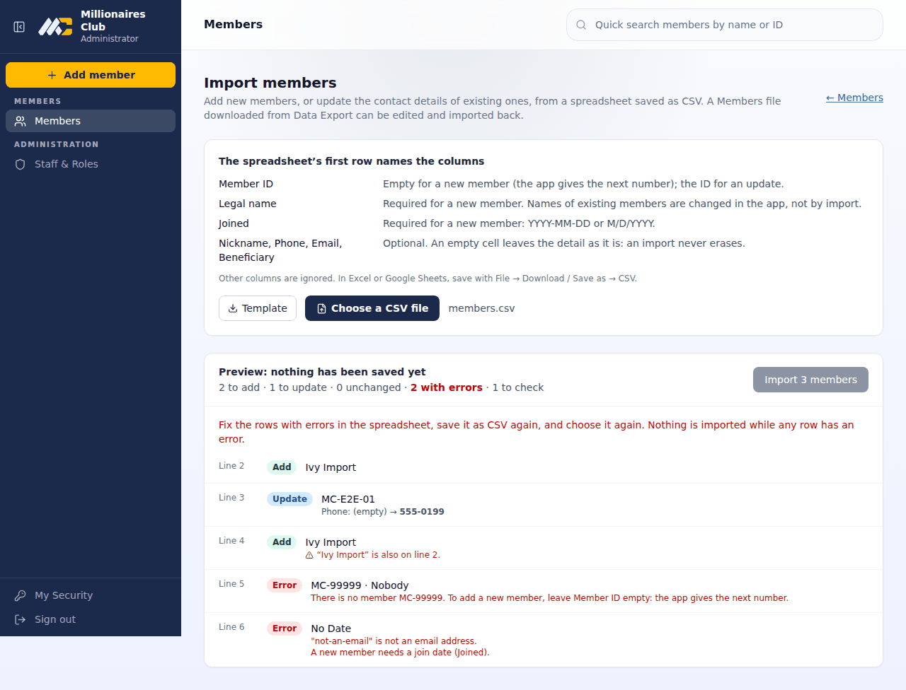

# Importing from a spreadsheet

Officers can bring records into the app from a spreadsheet saved as CSV, from Excel, Numbers or Google Sheets:

- **Members**, from **Members → Import from spreadsheet**: add new members, or update existing members' contact details. Needs permission `members.create`: the Administrator, the Super Admin and the transitional Club Officer.
- **Contributions**, from **Contributions → Import**: record a batch of payments. Needs permission `contributions.record`: Finance, the Treasurer, and the same administrators.

The database stays the club's official record. An import changes it only through the same steps as typing the records in, one by one.

## How it works

1. **Choose the file.** The app checks every row and shows a **preview**: what would be added, what would change (field by field, old → new), and what is refused, with the reason. **Nothing is saved yet.**
2. **Fix and choose again.** If any row has an error, nothing can be imported. Fix the rows in the spreadsheet, save it as CSV again, and choose it again.
3. **Import.** The file is checked once more, then **all rows are saved in one go, or none**: a failure halfway leaves nothing behind. Each record is audited as if typed in, plus one audit entry for the import (`IMP-…`).

**The same file cannot be imported twice.** The app keeps a fingerprint (SHA-256) of every imported file, and refuses one it has seen. A file saved on Windows or a Mac counts as the same file.

**Warnings** don't stop an import, but are worth a look:
- a new member whose name is already in the app, or twice in the file;
- a contribution that looks already recorded (same member, date and amount), or appears twice in the file;
- a payment for an inactive member.

## Members

| Column | |
|---|---|
| **Member ID** | Empty for a **new member**: the app gives the next number, as when adding by hand. The member's ID for an **update**. |
| **Legal name** | Required for a new member. |
| **Joined** | Required for a new member: `YYYY-MM-DD` or `M/D/YYYY`. |
| Nickname, Phone, Email, Beneficiary | Optional. |

**What an import will and won't change:**
- **Contact details only.** An update changes nickname, phone, email and beneficiary.
- **Blank cells change nothing.** An import never erases a detail.
- **Some things are changed in the app only,** one member at a time, so they can't change by accident in a sheet: names, join dates and status. A name that differs from the app is shown as a warning.
- **Money is never imported.** A member's contributions, balances and loans follow from recorded payments.
- **Roles that can't edit members:** a role that can add members but not edit them (none today) can import new members only.

**Round trip:** a **Members** file downloaded from **Data Export** can be edited and imported back. Its other columns (totals, status and so on) are ignored, and the preview lists them.

## Contributions

| Column | |
|---|---|
| **Member ID** | Required. |
| **Paid on** | Required: `YYYY-MM-DD` or `M/D/YYYY`, not in the future. |
| **Amount** | Required, in dollars: `20`, `20.00`, `$1,200.50`. |
| Method | Optional, e.g. Zelle, Cash. |
| Kind | `dues` (the default) or `voluntary`. |
| Received by, Note | Optional. |

Each contribution is recorded exactly as one typed in on the Contributions page:
- it gets its receipt number;
- it pays the member's oldest unpaid month first;
- it is posted to the ledger.

Its source shows as **Import**. To correct one after importing, reverse it on the Contributions page, as with any other.

## Limits

- **Size:** up to 1 MB and 2,000 rows per file. Split larger files.
- **Columns:** they are found by name in the first row, in any order. Other columns are ignored and listed in the preview. Each import page has a **Template** to start from.
- **Formulas:** cells are read as text. The apostrophe the export adds in front of formula-looking text is removed on import.
