# Member portal redesign

A visual refresh of the member portal: the same pages, figures, permissions and workflows, in a cleaner, more modern look. Staff pages are unchanged.

## What changed

**One look on every page** (`src/components/portal/kit.tsx`)

- Cards with soft shadows and rounded corners, one heading style, and icons that say what each section is.
- Statuses are always a word in a small pill (*Paid*, *Part paid*, *Unpaid*, *Being repaid*, *Late*), with colour only as a hint: green done, amber waiting, red late, blue in progress.
- Money is in tabular figures, so columns of amounts line up.
- Inter, self-hosted (`@fontsource-variable/inter`, no request to Google), in the club's navy `#1B2A4A` and gold `#F5B70A` (`docs/brand/README.md`).

**Navigation**

- **Desktop:** the menu sits in one rounded bar, with an icon on every entry and the current page in white. The member's name and ID move into an account menu (initials in gold), which holds *Sign out*.
- **Phones:** a tab bar at the bottom, within reach of the thumb (Home, Pay, History, Loan, and *More* for Statements and Loan Agreements), instead of a menu button at the top.

**Sign-in:** a navy page with the card in the middle, and a line telling members who forget their password that an officer can reset it (the portal has no self-service reset yet).

**Dashboard**

- A welcome banner: the member's name, ID and join date, *Paid this month* or *This month not paid yet*, the total contributed in large figures, and the two most common actions (*Make a payment*, *Statements*).
- Three figures below it: months active, paid this year, and borrowing (the amount the member can borrow, or *Not now* with the reason in plain words).
- Monthly dues, the loan (what is left, a progress bar, the next payment) and recent contributions, each in its own card.

**Make a Payment:** a larger amount field, and *Card* / *Zelle* as two clear choices with a line under each.

**Payment History**

- Totals at the top.
- Contributions by year as a list of bars that works for one year or twelve. Before, a single year filled the whole chart.
- This year's payments with their receipts.
- *Older loans (2021–2025)*, which was mislabelled *2024–2025*.

**My Loan:** what is still to repay in large figures, with the loan, paid so far, monthly payment and payoff beside it, then the next payment, the schedule and the payments.

**Loan Agreements:** each agreement as a card with its amount, term, role, status and one action (*Review & sign* or *View*).

## Fixes found along the way

- A member whose eligibility was stored as a bare `NO` saw "Not eligible now: NO." Every code now reads in plain words, including *Members can borrow after 6 months of membership* (`NO - Need 6 Months`, used by 6 members in the club's records). `tests/eligibility-text.test.ts` covers this.
- "1 years of contributions" now reads "1 year".
- A member who joined on 1 January was shown as joining the year before. The date is stored as midnight UTC and was read in the local time zone.

## Screenshots

Taken from the browser-test data (a member with a loan, two contributions and a Zelle payment), before and after, at 1280 × 900 and 390 × 844.

| | Before | After |
|---|---|---|
| Dashboard, desktop | 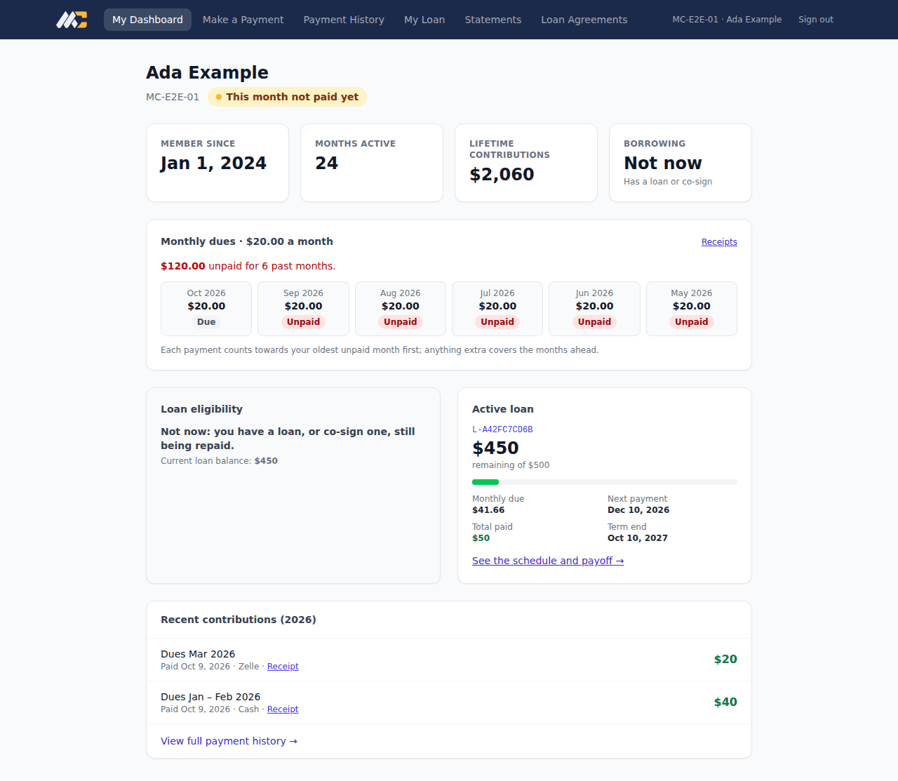 | 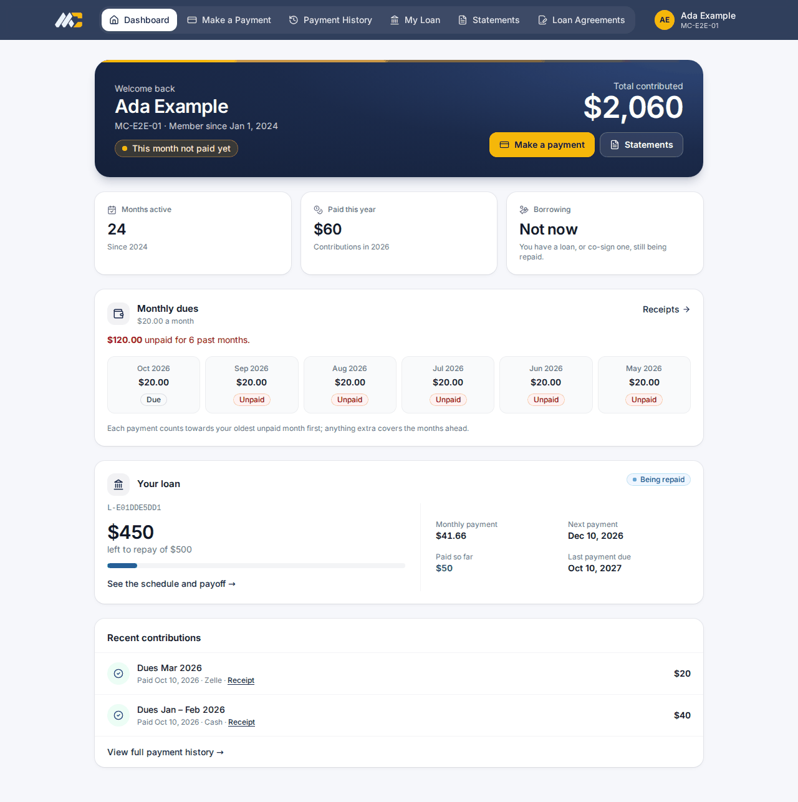 |
| Dashboard, phone | 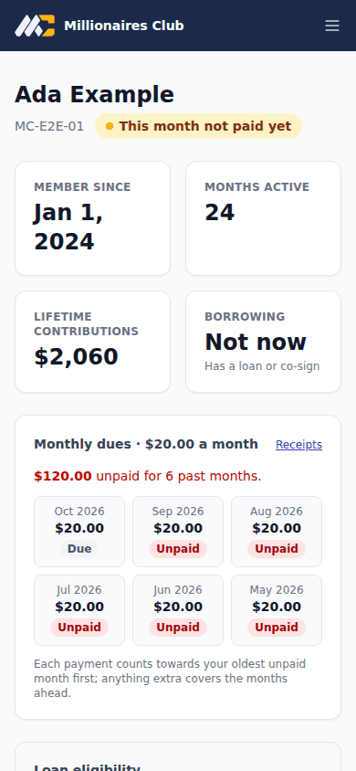 | 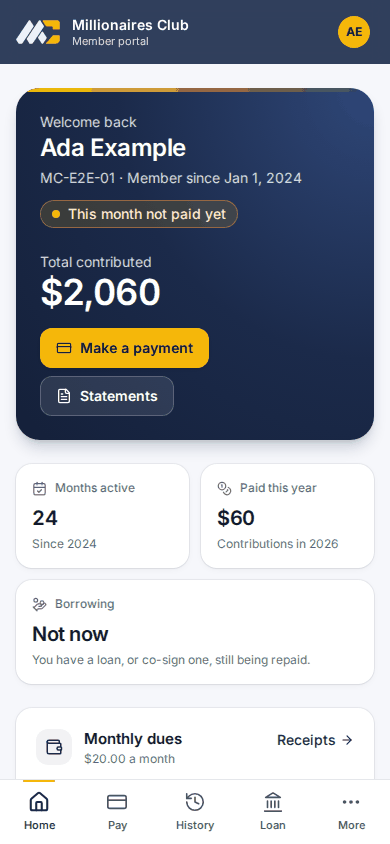 |
| Make a Payment | 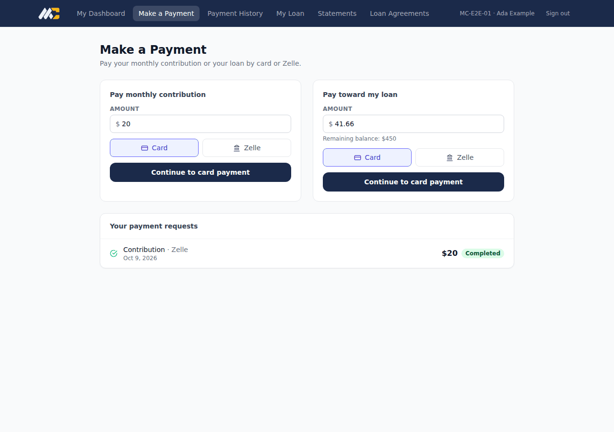 | 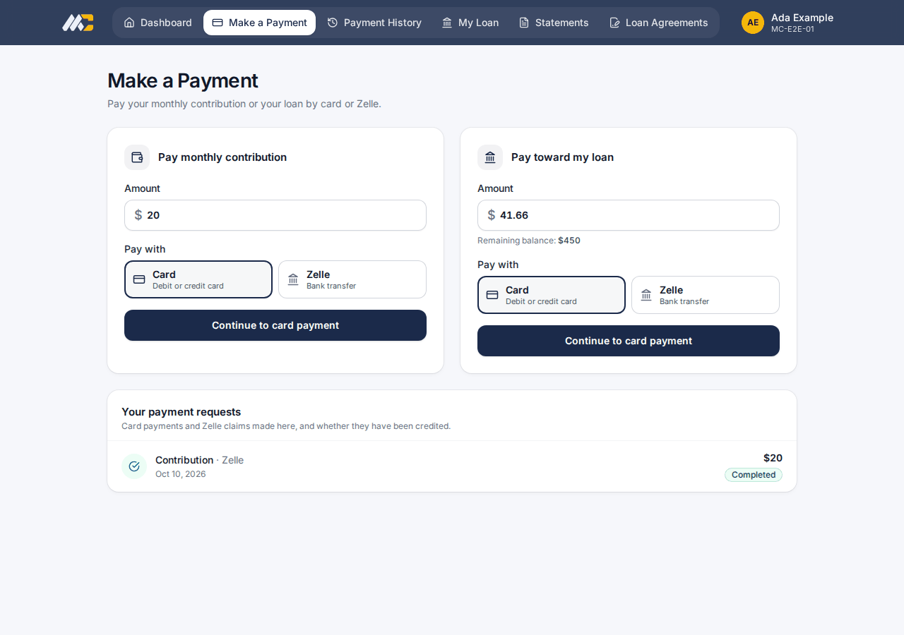 |
| Make a Payment, phone | 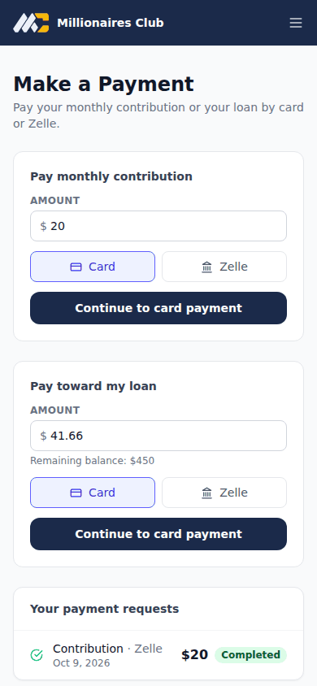 | 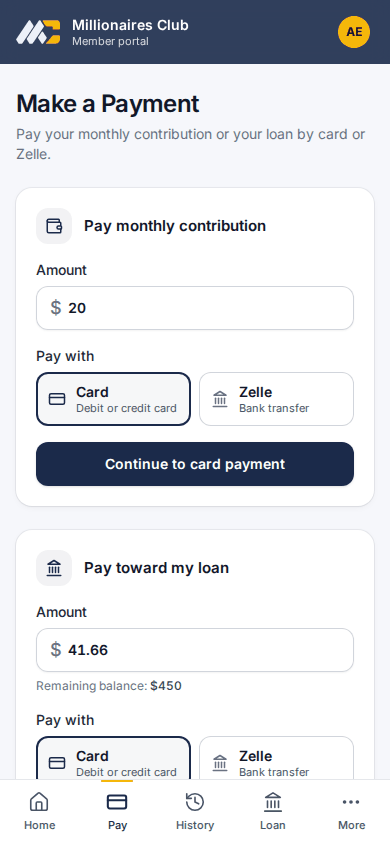 |
| My Loan | 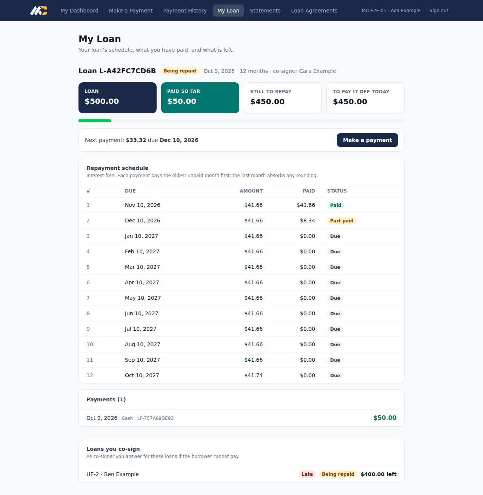 | 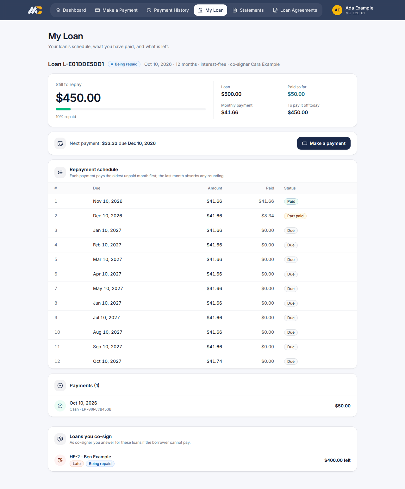 |
| Payment History | 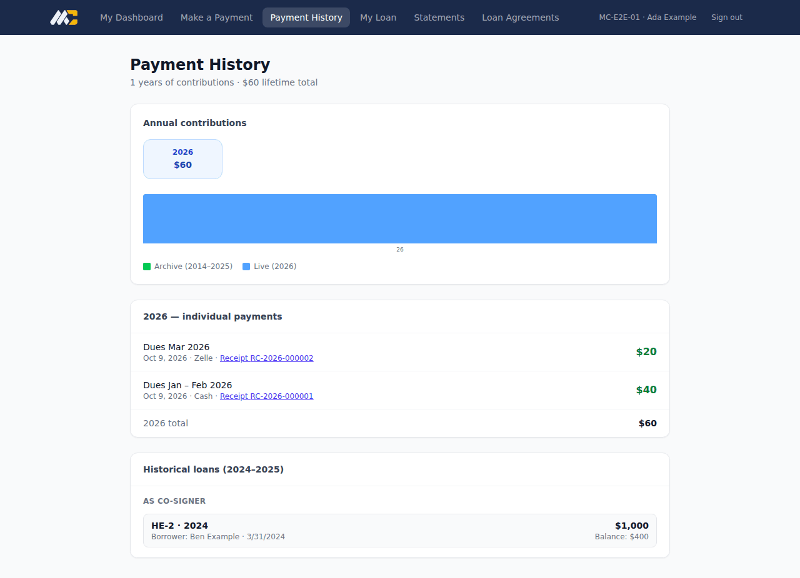 | 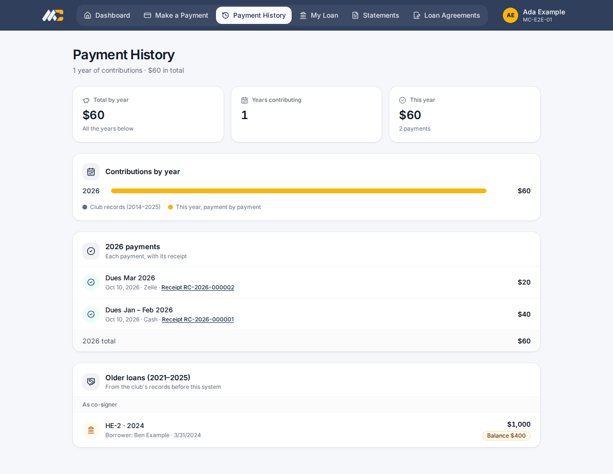 |
| Loan Agreements | 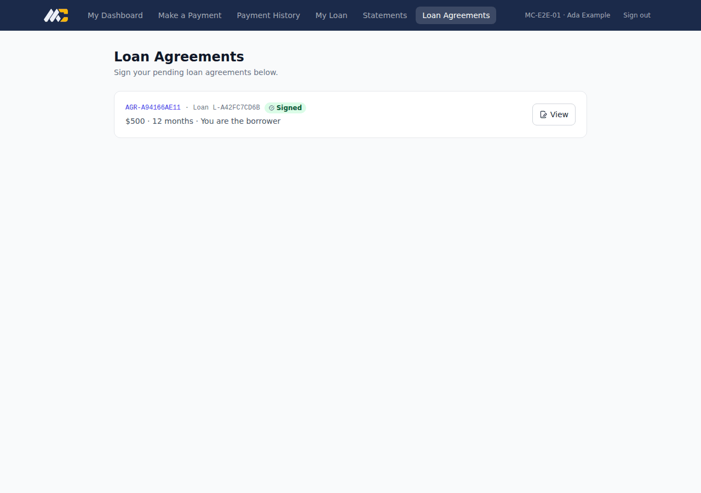 | 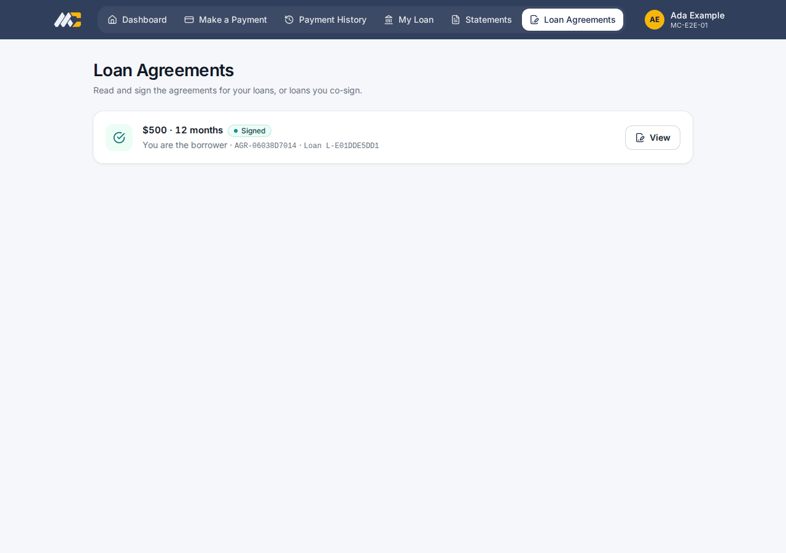 |
| Sign-in, phone | 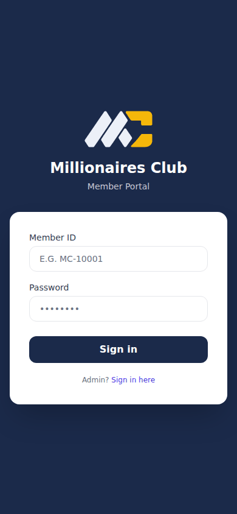 | 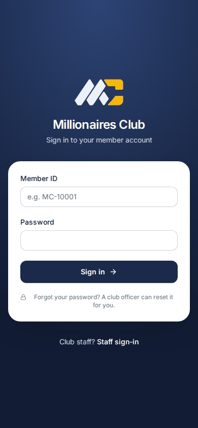 |
| Phone tab bar, *More* open | | 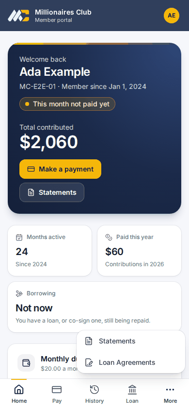 |

## Checks

- **Browser tests:** every browser test passes unchanged except one wording check, now matched to the shorter sentence. That covers signing in, paying by Zelle, signing a loan agreement, the loan schedule, statements, and receipts in the history.
- **Accessibility:** the automated WCAG 2.1 A/AA checks pass on every portal page, including colour contrast.
- **Phone layout:** no portal page scrolls sideways on a phone.
- **Same data and permissions:** the pages call the same APIs, with the same permissions, as before.
